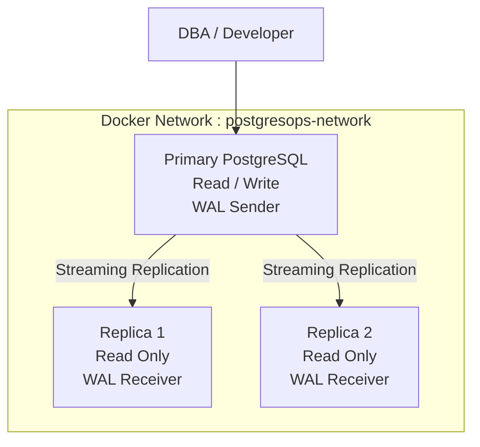
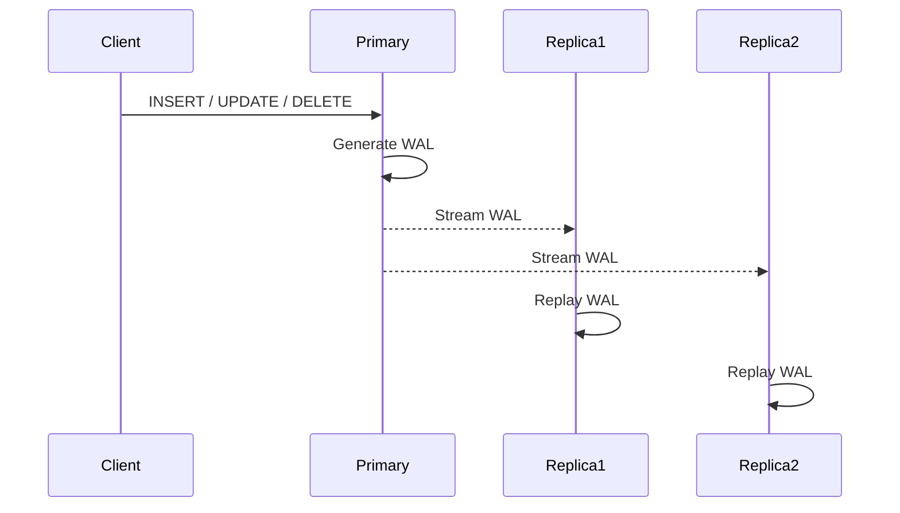
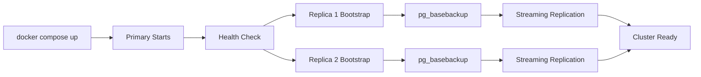
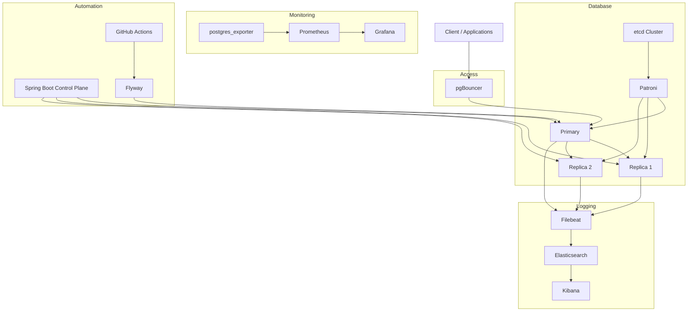

# Architecture

> This document describes the overall architecture of **PostgresOps**, a Dockerized PostgreSQL DBA Platform designed to simulate production-grade database administration, high availability, observability, disaster recovery, and automation.

---

# Design Principles

PostgresOps is designed around four core principles:

- High Availability
- Disaster Recovery
- Observability
- DBA Automation

The platform is built incrementally, with each phase adding production-grade capabilities while keeping the infrastructure modular and easy to understand.

---

# Current Architecture (Phase 1)

Phase 1 establishes the core PostgreSQL cluster.

- One Primary PostgreSQL node
- Two Streaming Replicas
- Docker Bridge Network
- Persistent Docker Volumes
- Custom PostgreSQL Configuration
- Replication Health Monitoring

## Architecture Diagram



---

# Current Data Flow



---

# Replication Architecture

The replication model follows PostgreSQL Streaming Replication.

```
                 Write Requests
                       │
                       ▼

              PostgreSQL Primary
                     │
              WAL Generation
                     │
         ┌───────────┴───────────┐
         │                       │
         ▼                       ▼

     Replica 1              Replica 2
  Read Only Node         Read Only Node

      WAL Replay           WAL Replay
```

Current replication mode:

- Streaming Replication
- Asynchronous Replication
- WAL-based synchronization
- Continuous recovery mode on replicas

---

# Current Infrastructure

```
PostgresOps
│
├── Primary Database
│      ├── Read / Write
│      ├── WAL Generation
│      └── Client Connections
│
├── Replica 1
│      ├── Read Only
│      └── WAL Replay
│
├── Replica 2
│      ├── Read Only
│      └── WAL Replay
│
└── Docker Bridge Network
```

---

# Repository Architecture

```text
postgresops/

├── docker/
│   ├── compose/
│   ├── postgres/
│   │      ├── primary/
│   │      ├── replica1/
│   │      └── replica2/
│   ├── pgadmin/
│   ├── pgbouncer/
│   ├── monitoring/
│   └── patroni/
│
├── configs/
│
├── scripts/
│
├── backups/
│
├── control-plane/
│
├── monitoring/
│
└── docs/
```

---

# Current Operational Flow



---

# Technology Stack

| Layer | Technology |
|--------|------------|
| Database | PostgreSQL 16 |
| Containerization | Docker |
| Networking | Docker Bridge Network |
| Replication | Streaming Replication |
| Authentication | PostgreSQL Roles |
| Monitoring | Shell Scripts (Phase 1) |

---

# Future Architecture

The current cluster serves as the foundation for the complete PostgresOps platform.

Future phases will progressively introduce additional production components.



---

# Planned Evolution

| Phase | Feature |
|--------|---------|
| ✅ Phase 1 | PostgreSQL Cluster & Streaming Replication |
| ⏳ Phase 2 | Backup Automation & Point-in-Time Recovery (PITR) |
| ⏳ Phase 3 | Monitoring & Observability (Prometheus, Grafana, ELK) |
| ⏳ Phase 4 | Spring Boot DBA Automation Platform |
| ⏳ Phase 5 | Patroni, pgBouncer, CI/CD, Security & Production Hardening |

---

# Architectural Goals

By the completion of PostgresOps, the platform will demonstrate:

- Production-inspired PostgreSQL High Availability
- Automated Disaster Recovery
- Database Observability
- Performance Monitoring
- DBA Automation
- Infrastructure as Code
- CI/CD for Database Operations
- Production-ready Docker Deployment
- Enterprise Documentation