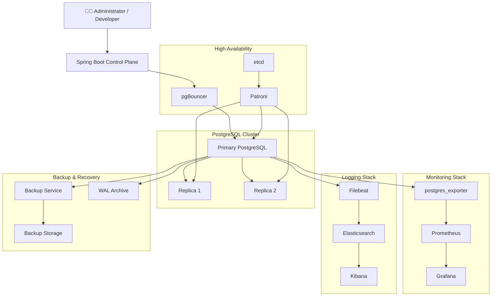
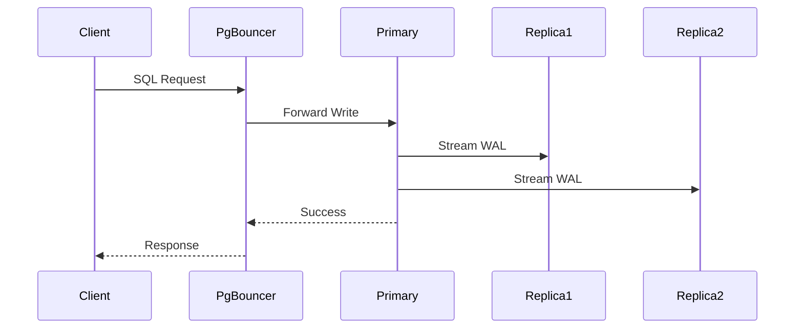
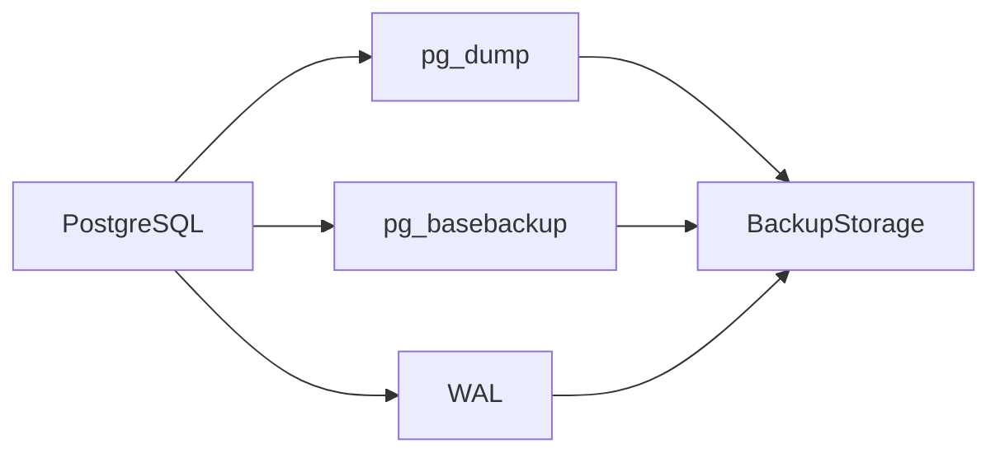

# PostgresOps Architecture

## Overview

PostgresOps is designed as a production-inspired PostgreSQL Operations Platform that combines High Availability, Disaster Recovery, Observability, Database Automation, and DevOps into a single self-contained environment.

The platform is intentionally modular, allowing each subsystem to evolve independently while working together as a complete operational ecosystem.

The architecture follows a layered approach where infrastructure, monitoring, automation, and management remain loosely coupled.

---

# High Level Architecture



---

# Layered Architecture

```text
┌─────────────────────────────────────────────┐
│                User Layer                   │
├─────────────────────────────────────────────┤
│ Spring Boot Control Plane / REST APIs / UI │
├─────────────────────────────────────────────┤
│ PostgreSQL Cluster + pgBouncer + Patroni   │
├─────────────────────────────────────────────┤
│ Monitoring + Logging + Backup Services     │
├─────────────────────────────────────────────┤
│ Docker Compose Infrastructure              │
└─────────────────────────────────────────────┘
```

---

# Component Responsibilities

## PostgreSQL Primary

The primary node accepts all write operations.

Responsibilities:

- Process write transactions
- Generate WAL records
- Stream WAL to replicas
- Serve read/write traffic

---

## PostgreSQL Replicas

Replica nodes continuously receive WAL records from the primary.

Responsibilities:

- Read-only workloads
- Failover candidates
- Backup verification
- High Availability

---

## Patroni

Patroni manages PostgreSQL High Availability.

Responsibilities:

- Leader election
- Automatic failover
- Replica promotion
- Cluster health monitoring

---

## etcd

Distributed consensus store used by Patroni.

Responsibilities:

- Cluster state
- Leader coordination
- Distributed locking

---

## pgBouncer

Connection pooler between applications and PostgreSQL.

Responsibilities:

- Connection pooling
- Reduced connection overhead
- Efficient resource utilization

---

## Backup Service

Responsible for database recovery.

Features:

- Logical backups
- Physical backups
- WAL archiving
- PITR

---

## Monitoring Stack

Collects PostgreSQL metrics.

Components:

- postgres_exporter
- Prometheus
- Grafana

Provides dashboards for:

- Active connections
- Cache hit ratio
- Replication lag
- Dead tuples
- Database size
- Transaction rate

---

## Logging Stack

Responsible for log aggregation.

Components:

- Filebeat
- Elasticsearch
- Kibana

Provides:

- Slow query logs
- PostgreSQL errors
- Checkpoint logs
- Connection logs

---

## Spring Boot Control Plane

The Control Plane is the central management service of the platform.

Responsibilities include:

- Cluster health APIs
- Database statistics
- Replication monitoring
- Backup management
- Maintenance scheduling
- REST APIs
- Administrative dashboard

Unlike a traditional application backend, the Control Plane does not own business data.

Instead, it manages the operational state of the PostgreSQL platform.

---

# Data Flow

## Write Operations



---

## Monitoring Flow


---

## Logging Flow


---

## Backup Flow



---

# Technology Decisions

| Component | Selected Technology | Reason |
|------------|--------------------|--------|
| Database | PostgreSQL | Open-source, enterprise-grade relational database |
| Containers | Docker Compose | Easy local orchestration |
| Backend | Spring Boot | Familiar ecosystem with strong automation capabilities |
| Monitoring | Prometheus | Native metrics collection |
| Visualization | Grafana | Rich dashboards |
| Logging | ELK Stack | Centralized log aggregation |
| HA | Patroni | PostgreSQL-native failover solution |
| Connection Pool | pgBouncer | Lightweight connection pooling |
| Schema Migration | Flyway | Version-controlled database migrations |
| CI/CD | GitHub Actions | Automated testing and deployment |

---

# Future Architecture

The current implementation targets a Docker Compose based environment.

Future enhancements include:

- Kubernetes deployment
- Multi-region replication
- Read/write splitting
- Logical replication
- Distributed backup storage
- AI-assisted maintenance recommendations
- Self-healing automation
- Multi-node monitoring

---

# Architecture Goals

The architecture is designed around five core principles:

- **Reliability** – Ensure continuous database availability.
- **Recoverability** – Support rapid recovery from failures.
- **Observability** – Provide visibility into database behavior.
- **Automation** – Reduce manual operational effort.
- **Scalability** – Allow future expansion without redesign.

---

# Architecture Evolution

| Phase | Major Deliverable |
|--------|-------------------|
| Phase 0 | Repository Foundation |
| Phase 1 | PostgreSQL High Availability Cluster |
| Phase 2 | Backup & Disaster Recovery |
| Phase 3 | Monitoring & Logging |
| Phase 4 | Spring Boot Control Plane |
| Phase 5 | Production Readiness |