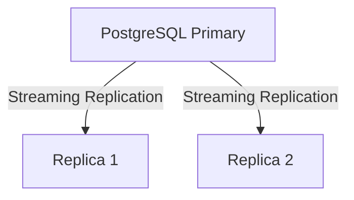

# PostgresOps Journal

> Operational runbook and development journal for the **PostgresOps** project.

This document serves as a quick reference for starting the infrastructure, verifying cluster health, performing replication tests, and troubleshooting the PostgreSQL cluster during development.

---

# Project Status

| Phase | Status |
|--------|--------|
| Phase 0 — Project Planning | ✅ Completed |
| Phase 1 — High Availability Cluster | ✅ Completed |
| Phase 2 — Backup & Recovery | ⏳ Upcoming |
| Phase 3 — Monitoring & Observability | ⏳ Upcoming |
| Phase 4 — DBA Automation Service | ⏳ Upcoming |
| Phase 5 — CI/CD & Security | ⏳ Upcoming |

---

# Current Cluster



Current Replication Mode

- Streaming Replication
- Asynchronous Replication
- WAL Shipping
- One Primary
- Two Read-only Replicas

---

# Repository Root

```text
PostgresOps/

docker/
configs/
scripts/
docs/
backups/
control-plane/
docker-compose.yml
```

---

# Docker Operations

## Start Entire Cluster

```bash
docker compose up -d
```

---

## Stop Entire Cluster

```bash
docker compose down
```

---

## Stop Cluster and Remove Volumes (Destructive)

```bash
docker compose down -v
```

Use only when you want to completely recreate the PostgreSQL cluster.

---

## Restart Cluster

```bash
docker compose restart
```

---

## View Running Containers

```bash
docker ps
```

---

## View All Containers

```bash
docker ps -a
```

---

## List Docker Networks

```bash
docker network ls
```

---

## Inspect Cluster Network

```bash
docker network inspect compose_postgresops-network
```

---

## List Docker Volumes

```bash
docker volume ls
```

---

## View Container Logs

### Primary

```bash
docker logs postgresops-primary
```

Live logs

```bash
docker logs -f postgresops-primary
```

---

### Replica 1

```bash
docker logs postgresops-replica1
```

---

### Replica 2

```bash
docker logs postgresops-replica2
```

---

# PostgreSQL Access

## Connect to Primary

```bash
docker exec -it postgresops-primary \
psql -U postgres -d postgresops
```

---

## Connect to Replica 1

```bash
docker exec -it postgresops-replica1 \
psql -U postgres -d postgresops
```

---

## Connect to Replica 2

```bash
docker exec -it postgresops-replica2 \
psql -U postgres -d postgresops
```

---

# Cluster Verification

## Verify Primary

```sql
SELECT pg_is_in_recovery();
```

Expected

```text
false
```

---

## Verify Replica

```sql
SELECT pg_is_in_recovery();
```

Expected

```text
true
```

---

## Verify Streaming Replication

Run on Primary

```sql
SELECT
    client_addr,
    state,
    sync_state
FROM pg_stat_replication;
```

Expected

```text
2 rows

state = streaming

sync_state = async
```

---

## Check Replication Lag

```sql
SELECT
    client_addr,
    state,
    sync_state,
    pg_wal_lsn_diff(sent_lsn, replay_lsn)
AS replication_lag_bytes
FROM pg_stat_replication;
```

Healthy Output

```text
replication_lag_bytes = 0
```

---

# Replication Testing

## Create Test Table

```sql
CREATE TABLE test_replication(

    id SERIAL PRIMARY KEY,

    message TEXT,

    created_at TIMESTAMP DEFAULT NOW()

);
```

---

## Insert Test Record

```sql
INSERT INTO test_replication(message)
VALUES('Hello from Primary');
```

---

## Verify Replication

Run on Replica

```sql
SELECT *
FROM test_replication
ORDER BY id;
```

Expected

Data inserted into Primary should automatically appear on both replicas.

---

# Failure Simulation

## Stop Replica 1

```bash
docker stop postgresops-replica1
```

---

## Start Replica 1

```bash
docker start postgresops-replica1
```

---

## Stop Replica 2

```bash
docker stop postgresops-replica2
```

---

## Start Replica 2

```bash
docker start postgresops-replica2
```

---

## Verify Automatic Catch-up

1. Stop Replica
2. Insert new rows into Primary
3. Start Replica
4. Verify missing rows appear automatically

---

# Health Check Script

Execute

```bash
./scripts/replication-health.sh
```

Expected Output

```text
client_addr

state

sync_state

replication_lag_bytes
```

Healthy Cluster

```text
streaming

async

0 bytes lag
```

---

# Useful SQL Queries

## Current Database

```sql
SELECT current_database();
```

---

## Current User

```sql
SELECT current_user;
```

---

## PostgreSQL Version

```sql
SELECT version();
```

---

## Show Configuration File

```sql
SHOW config_file;
```

---

## Show pg_hba.conf

```sql
SHOW hba_file;
```

---

## List Roles

```sql
SELECT
rolname,
rolreplication
FROM pg_roles;
```

---

## Show Replication Users

```sql
SELECT
rolname
FROM pg_roles
WHERE rolreplication = true;
```

---

# Phase 1 Achievements

- ✅ Dockerized PostgreSQL infrastructure
- ✅ Primary database server
- ✅ Replica 1
- ✅ Replica 2
- ✅ Custom PostgreSQL configuration
- ✅ Custom pg_hba.conf
- ✅ Replication user
- ✅ Streaming Replication
- ✅ WAL-based synchronization
- ✅ Replica bootstrap automation
- ✅ Multi-replica architecture
- ✅ Replication health monitoring
- ✅ Failure and recovery validation
- ✅ Live data synchronization testing

---

# Lessons Learned

## PostgreSQL Streaming Replication

- Primary generates WAL records.
- Replicas continuously receive WAL.
- Replicas replay WAL to remain synchronized.

---

## Replica Recovery

If a replica becomes unavailable:

1. Primary continues accepting writes.
2. WAL files continue accumulating.
3. Replica reconnects.
4. Missing WAL is streamed.
5. Replica automatically catches up.

---

## Replication Characteristics

Current configuration

- Asynchronous Replication
- Read-only replicas
- Continuous WAL streaming
- Automatic recovery after downtime

---

# Next Milestone

## Phase 2 — Backup & Disaster Recovery

Upcoming work

- Automated `pg_dump`
- Physical Backups (`pg_basebackup`)
- WAL Archiving
- Point-in-Time Recovery (PITR)
- Restore Automation
- Backup Retention Policies
- MinIO Integration