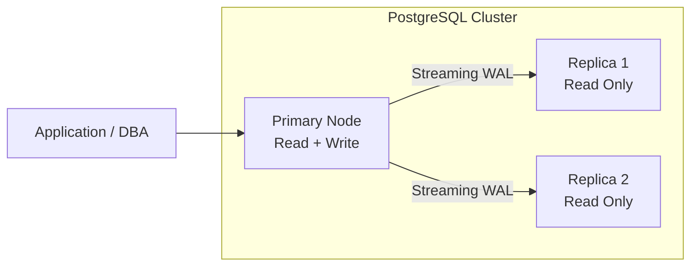
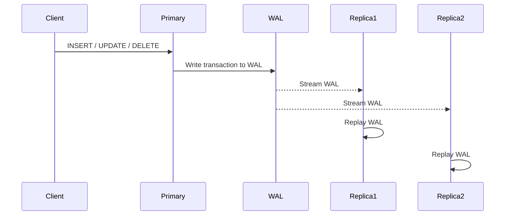
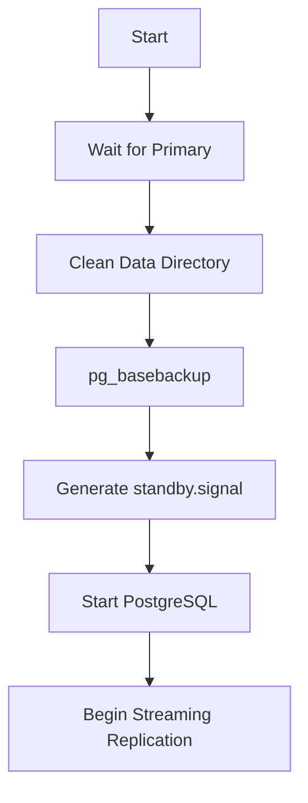

# PostgreSQL Streaming Replication

> This document explains the replication architecture, implementation details, and validation process used in **PostgresOps**.

---

# Overview

Replication is the process of maintaining one or more copies of a PostgreSQL database that continuously receive changes from a primary server.

In PostgresOps, replication is implemented using **PostgreSQL Physical Streaming Replication**, where replicas continuously replay Write-Ahead Log (WAL) records generated by the primary database.

This architecture provides:

- High Availability (HA)
- Read Scaling
- Disaster Recovery
- Reduced Recovery Time
- Foundation for Automatic Failover

---

# Replication Architecture



---

# Replication Flow

Every transaction committed on the primary database follows the sequence below.



---

# How Streaming Replication Works

## Step 1

A client performs a write operation.

```sql
INSERT INTO users VALUES (...);
```

---

## Step 2

Instead of immediately modifying data files, PostgreSQL first writes the transaction into the **Write-Ahead Log (WAL)**.

```
Transaction

↓

Write WAL

↓

Commit
```

This guarantees durability.

---

## Step 3

The WAL sender process on the primary streams WAL records to connected replicas.

```
Primary

↓

WAL Sender

↓

Replica
```

---

## Step 4

Each replica receives WAL records and stores them locally.

```
Receive WAL

↓

Write WAL

↓

Replay WAL

↓

Update Database Files
```

At this point, replicas become consistent with the primary.

---

# Cluster Topology

Current cluster consists of:

| Node | Role | Read | Write |
|------|------|------|-------|
| Primary | Read/Write | ✅ | ✅ |
| Replica 1 | Standby | ✅ | ❌ |
| Replica 2 | Standby | ✅ | ❌ |

---

# Replication Mode

Current implementation uses:

## Asynchronous Streaming Replication

```
Client

↓

Primary commits transaction

↓

Transaction completes immediately

↓

Replica receives WAL afterwards
```

Advantages

- Fast commits
- Low latency
- Minimal impact on write performance

Trade-off

A very small amount of recently committed data may not yet exist on a replica if the primary fails unexpectedly.

---

# Replication User

Replication is performed using a dedicated PostgreSQL role.

```sql
CREATE ROLE replicator
WITH REPLICATION
LOGIN
PASSWORD '********';
```

This user has only the permissions required for streaming replication.

---

# Replica Bootstrap

Replicas are not initialized manually.

Instead, each replica executes an automated bootstrap script.

The process is:



The bootstrap script performs:

- Wait for primary availability
- Remove existing data directory
- Execute `pg_basebackup`
- Generate replica configuration (`-R`)
- Start PostgreSQL

---

# Verifying Replication

## Verify Primary

```sql
SELECT pg_is_in_recovery();
```

Expected

```
false
```

The primary database should never be in recovery mode.

---

## Verify Replica

```sql
SELECT pg_is_in_recovery();
```

Expected

```
true
```

Replica databases always remain in recovery mode while replaying WAL.

---

## Check Connected Replicas

```sql
SELECT
    client_addr,
    state,
    sync_state
FROM pg_stat_replication;
```

Example

```
client_addr   state       sync_state
------------------------------------
172.18.0.3    streaming   async
172.18.0.4    streaming   async
```

---

## Check Replication Lag

```sql
SELECT
    client_addr,
    state,
    pg_wal_lsn_diff(sent_lsn, replay_lsn)
        AS replication_lag_bytes
FROM pg_stat_replication;
```

Example

```
client_addr   lag
------------------
172.18.0.3    0
172.18.0.4    0
```

A lag of **0 bytes** indicates replicas are fully synchronized.

---

# Failure Recovery Test

Replication recovery was validated by performing the following steps.

## Step 1

Stop Replica 1.

```bash
docker stop postgresops-replica1
```

---

## Step 2

Insert additional records into the primary database.

```sql
INSERT INTO test_replication (message)
VALUES ('Message while replica is down');
```

---

## Step 3

Restart Replica 1.

```bash
docker start postgresops-replica1
```

---

## Step 4

Verify that Replica 1 automatically requests missing WAL records and catches up without requiring a fresh base backup.

Result:

- No data loss
- Automatic synchronization
- WAL replay successful

---

# Multi-Replica Validation

The cluster currently contains two replicas.

```
Primary

├── Replica 1

└── Replica 2
```

Both replicas were verified by:

- Creating test tables
- Inserting records on the primary
- Reading identical data from both replicas

This confirms that PostgreSQL supports **fan-out replication**, where a single primary streams WAL concurrently to multiple standby servers.

---

# Current Limitations

Current implementation intentionally keeps the architecture simple.

Not yet implemented:

- Synchronous replication
- Replication slots
- Automatic failover
- Patroni cluster management
- pgBouncer connection pooling
- Read query routing
- Cascading replication

These features will be introduced in later phases.

---

# Key PostgreSQL Concepts

| Component | Purpose |
|-----------|---------|
| WAL | Guarantees durability and replication |
| WAL Sender | Streams WAL from primary |
| WAL Receiver | Receives WAL on replicas |
| Startup Process | Replays WAL on replicas |
| `pg_basebackup` | Creates a physical replica |
| `pg_stat_replication` | Monitors replication status |
| `pg_is_in_recovery()` | Identifies primary vs replica |

---

# Summary

At the end of Phase 1, PostgresOps provides:

- Dockerized PostgreSQL cluster
- One Primary node
- Two Replica nodes
- Physical Streaming Replication
- Automated Replica Bootstrap
- Multi-Replica Synchronization
- Replication Health Monitoring
- Failure Recovery Validation

This architecture forms the foundation for future phases, including automatic failover, backup and recovery, observability, and database automation.